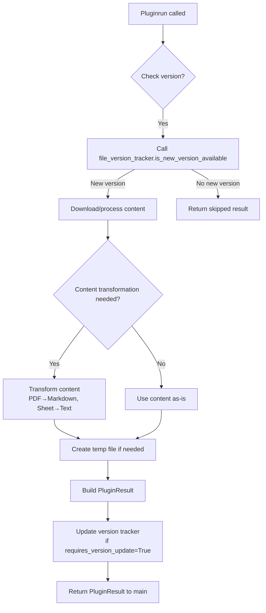

# Unified Return Mechanism for Document Loader Plugins

## Current State Analysis

### Plugin Framework Architecture
- **Main entry point**: `main.py` loads plugins via `PluginLoader`
- **Plugin base class**: `DocumentLoaderPlugin` (abstract) defines `run()` method returning `dict`
- **Example plugin**: `MigrationTracker` downloads Google Sheet data, converts to text, creates temp file
- **Current return behavior**: `run()` method in `MigrationTracker` does **not return anything** (ends at line 189 without return statement)

### Identified Gaps
1. **Inconsistent return values**: Plugin `run()` method signature expects `dict` return but implementation doesn't return
2. **Missing data flow**: Main program calls `plugin_instance.run()` but doesn't use result
3. **No standardized output format**: Different plugins may need to return:
   - Raw content (text)
   - File path to processed document
   - Metadata about the processed content
   - Transformation status
4. **Version tracking integration**: File version tracker updates not being triggered after successful processing

## Design Requirements

### Use Cases
1. **PDF files**: Plugin downloads PDF → may convert to text using Docling → returns file path to converted markdown
2. **Google Sheets**: Plugin downloads sheet → converts to structured text → returns file path to text file
3. **Direct content**: Plugin generates content directly → returns content string
4. **Mixed scenarios**: Plugin may need to return both content AND file path for downstream processing

### Constraints
- Some plugins require content transformation (PDF → markdown)
- Some plugins don't need transformation (already have usable content)
- Main program should be able to handle all return types uniformly
- Version tracking should be updated only after successful processing

## Proposed Solution

### 1. Standardized Return Type
Define a `PluginResult` dataclass to encapsulate all possible outputs:

```python
from dataclasses import dataclass
from typing import Optional
from pathlib import Path

@dataclass
class PluginResult:
    """Standardized return type for document loader plugins"""
    success: bool
    content: Optional[str] = None          # Direct content (text/markdown)
    file_path: Optional[Path] = None       # Path to generated file
    metadata: Optional[dict] = None        # Additional metadata (source, size, etc.)
    error_message: Optional[str] = None    # Error details if success=False
    requires_version_update: bool = True   # Whether to update file version tracker
```

### 2. Updated Base Class
Modify `DocumentLoaderPlugin` abstract method signature:

```python
@abstractmethod
def run(self) -> PluginResult:
    """Execute plugin logic and return standardized result"""
    pass
```

### 3. Helper Methods in Base Class
Add convenience methods to base class:
- `create_result()` - factory method for creating `PluginResult` instances
- `update_version_tracker(filename)` - wrapper to call `file_version_tracker.set_last_version()`
- `should_process()` - check if new version is available using version tracker

### 4. Processing Workflow



### 5. Main Program Integration
Update `main.py` to handle `PluginResult`:

```python
for plugin_name in plugins:
    try:
        plugin_context = plugins[plugin_name]
        plugin_instance: DocumentLoaderPlugin = plugin_context['plugin_instance']
        
        result: PluginResult = plugin_instance.run()
        
        if result.success:
            if result.content:
                # Process direct content
                process_content(result.content)
            if result.file_path:
                # Process file
                process_file(result.file_path)
            
            # Log metadata if present
            if result.metadata:
                logger.info(f"Plugin {plugin_name} metadata: {result.metadata}")
        else:
            logger.error(f"Plugin {plugin_name} failed: {result.error_message}")
            
    except Exception as e:
        print(f"Error: {e}")
```

## Implementation Plan

### Phase 1: Core Data Structures
1. Create `PluginResult` dataclass in `plugins/document_loader_plugin.py`
2. Update abstract `run()` method signature
3. Add helper methods to base class

### Phase 2: Migrate Existing Plugin
1. Update `MigrationTracker.run()` to return `PluginResult`
2. Implement proper success/failure handling
3. Integrate version tracking updates

### Phase 3: Main Program Updates
1. Update `main.py` to handle `PluginResult`
2. Add content/file processing logic
3. Improve error handling and logging

### Phase 4: New Plugin Template
1. Create plugin template demonstrating best practices
2. Document the unified return mechanism
3. Add example implementations for different scenarios

## Considerations

### File Path vs Content
- **Rule**: If transformation creates a file (PDF conversion), return `file_path`
- **Rule**: If content is directly usable as text, return `content`
- **Option**: Both can be returned if useful for downstream processing

### Version Tracking
- Plugins should only update version tracker after successful processing
- Use `requires_version_update` flag to control this behavior
- Some plugins may process multiple files - need extended mechanism

### Error Handling
- `PluginResult.success` indicates overall operation status
- Detailed error messages in `error_message`
- Exceptions should still be raised for catastrophic failures

### Backward Compatibility
- Existing plugins will need modification but framework is simple
- Main program currently ignores return values, so changes are safe

## Next Steps
1. Review and approve this design
2. Implement Phase 1 (core data structures)
3. Test with MigrationTracker plugin
4. Extend to support new plugin types (PDF, GDrive, etc.)